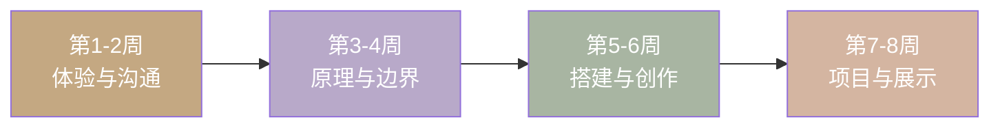

## 📋 课程总览

<DayProgress
  label="总进度"
  :done="0"
  :total="40"
  :percent="0"
/>

### 学习路线图

### 每周主题

| 周次 | 主题 | 核心能力 | 产出 |
|------|------|---------|------|
| 第1周 | 🤖 AI能干什么 | 体验5种AI能力 | 画作、对话截图、视频 |
| 第2周 | 💬 学会和AI说话 | 提示词工程入门 | 对比实验记录 |
| 第3周 | 🧠 AI怎么学习 | 理解训练原理 | 自己训练的模型 |
| 第4周 | ⚠️ AI的边界 | 安全与批判思维 | AI使用守则 |
| 第5周 | 🧱 零代码搭建 | 积木编程+Bot | 互动游戏+AI助手 |
| 第6周 | 🎨 AI绘画深度 | 风格/构图/角色 | 表情包+Mini绘本 |
| 第7周 | 🏗️ 综合项目 | 独立创作 | 完整AI作品 |
| 第8周 | 🎉 打磨与展示 | 迭代与表达 | 成果展+证书 |

---

## 🛠 需要准备的账号（一次性）

在孩子开始学习之前，请家长先完成以下账号注册：

| 工具 | 用途 | 链接 | 费用 |
|------|------|------|------|
| 豆包 | AI对话 | [doubao.com](https://www.doubao.com) | 免费 |
| 即梦 | AI画画 | [jimeng.jianying.com](https://jimeng.jianying.com) | 免费有额度 |
| ChatGPT | AI对话（备选） | [chat.openai.com](https://chat.openai.com) | 免费 |
| Coze（扣子） | 搭建AI助手 | [www.coze.com](https://www.coze.com) | 免费 |
| mBlock | 积木编程 | [www.mblock.cc](https://www.mblock.cc/zh-cn/download/) | 免费 |

**无需注册、打开即用的工具**：

| 工具 | 用途 | 链接 |
|------|------|------|
| Teachable Machine | 训练AI识别 | [teachablemachine.withgoogle.com](https://teachablemachine.withgoogle.com/) |
| ML for Kids | 儿童机器学习 | [machinelearningforkids.co.uk](https://machinelearningforkids.co.uk/) |
| TensorFlow Playground | 神经网络可视化 | [playground.tensorflow.org](https://playground.tensorflow.org/) |
| Quick, Draw! | AI猜画游戏 | [quickdraw.withgoogle.com](https://quickdraw.withgoogle.com/) |

---

## 🚀 快速开始

1. **注册账号**：花30分钟，把上面的工具都注册好
2. **创建文件夹**：在电脑上建一个"暑假AI作品"文件夹，按8周建子文件夹
3. **从第1周第1天开始**：打开链接，照着做，打勾，搞定

::: tip 💡 提示
每天45分钟。遇到卡住超过20分钟就跳过，保护兴趣第一。家长是"同学"不是"老师"，一起探索。
:::
